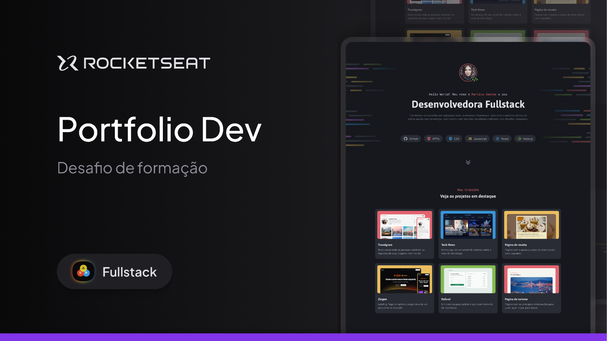

<h1 align="center">
  Portfólio Dev </>
</h1>

Portfolio Dev é um site desktop de portfólio para desenvolvedores, com links para projetos e contato do profissional. 
Esse é um dos desafios práticos da formação Fullstack, um dos conteúdos disponíveis para alunos da Rocketseat. 

  <a href="#-tecnologias">Tecnologias</a>&nbsp;&nbsp;&nbsp;|&nbsp;&nbsp;&nbsp;
  <a href="#-projeto">Projeto</a>&nbsp;&nbsp;&nbsp;|&nbsp;&nbsp;&nbsp;
  <a href="#memo-licença">Licença</a>

  

 

  

## 🚀 Tecnologias

Esse projeto foi desenvolvido com as seguintes tecnologias:

- HTML
- CSS

## Projeto

Nesse projeto desenvolvemos um site desktop de portfólio para desenvolvedores para praticar o nosso conhecimento com:

   - Criação de layouts com CSS;
   - Posicionamento de elementos; 
   - Variáveis CSS;
   - CSS Flexbox;
   - CSS Grid;
   - Pseudo-class e pseudo-elements;
   

                      Desenvolvido por Juliano Castro com mentoria da Rocketseat.